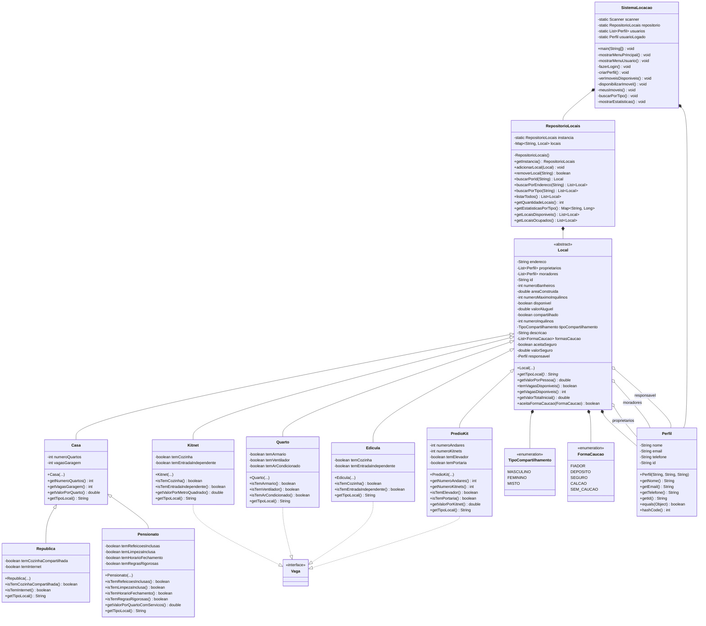
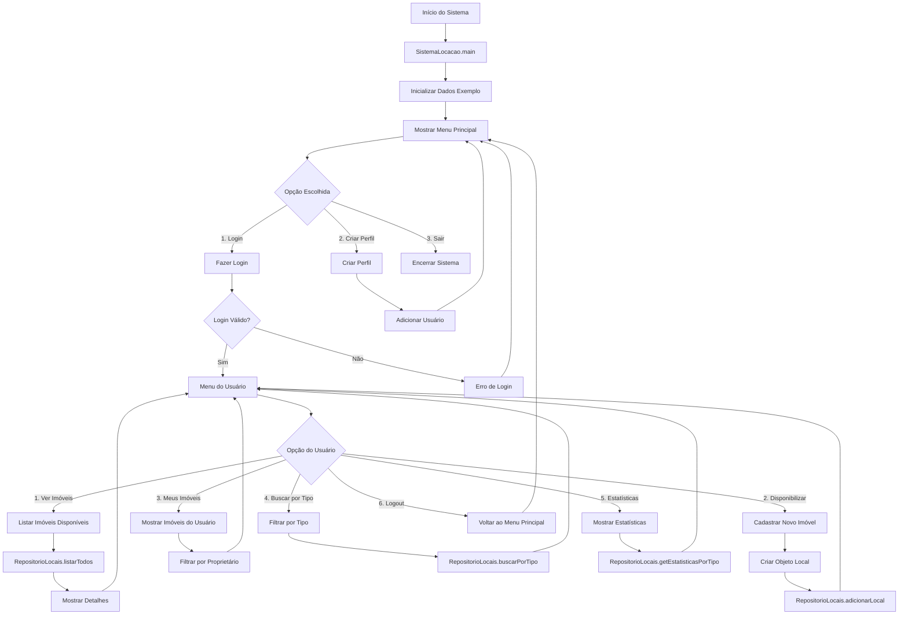
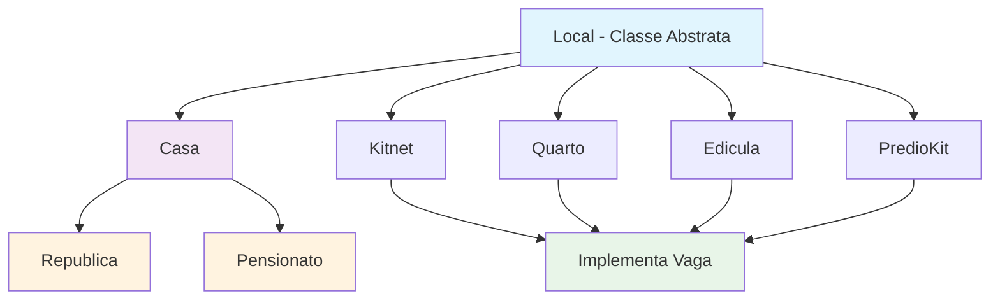

# Fluxograma da Estrutura Orientada a Objetos - Sistema de Locação de Imóveis

## 🏗️ Visão Geral da Arquitetura OO

Este documento apresenta um fluxograma visual da estrutura orientada a objetos do Sistema de Locação de Imóveis, mostrando as classes, heranças, interfaces e relacionamentos.

## 📊 Diagrama de Classes Principal



## 🔄 Fluxo de Execução do Sistema



## 🏠 Hierarquia de Tipos de Imóveis



## 🔐 Padrões de Design Utilizados

### 1. **Singleton Pattern**

```java
// RepositorioLocais - Garante uma única instância
public class RepositorioLocais {
    private static RepositorioLocais instancia;

    public static RepositorioLocais getInstancia() {
        if (instancia == null) {
            instancia = new RepositorioLocais();
        }
        return instancia;
    }
}
```

### 2. **Template Method Pattern**

```java
// Local - Método abstrato
public abstract class Local {
    public abstract String getTipoLocal();

    // Método template que usa o método abstrato
    public String getDescricaoCompleta() {
        return getTipoLocal() + " - " + getEndereco();
    }
}
```

### 3. **Strategy Pattern**

```java
// Enum FormaCaucao - Diferentes estratégias de caução
public enum FormaCaucao {
    FIADOR, DEPOSITO, SEGURO, CALCAO, SEM_CAUCAO
}
```

## 📋 Atributos e Métodos Principais

### **Classe Local (Abstrata)**

- **Atributos**: endereco, proprietarios, moradores, areaConstruida, valorAluguel
- **Métodos**: getTipoLocal()\*, getValorPorPessoa(), temVagasDisponiveis()

### **Classe Casa**

- **Atributos**: numeroQuartos, vagasGaragem
- **Métodos**: getValorPorQuarto(), getTipoLocal()

### **Classe Republica**

- **Atributos**: temCozinhaCompartilhada, temInternet
- **Métodos**: isTemCozinhaCompartilhada(), isTemInternet()

### **Classe Pensionato**

- **Atributos**: temRefeicoesInclusas, temLimpezaInclusa, temHorarioFechamento
- **Métodos**: getValorPorQuartoComServicos()

## 🔗 Relacionamentos entre Classes

### **Herança (extends)**

- `Casa extends Local`
- `Republica extends Casa`
- `Pensionato extends Casa`
- `Kitnet extends Local`
- `Quarto extends Local`
- `Edicula extends Local`
- `PredioKit extends Local`

### **Implementação (implements)**

- `Kitnet implements Vaga`
- `Quarto implements Vaga`
- `Edicula implements Vaga`
- `PredioKit implements Vaga`

### **Composição (has-a)**

- `Local has TipoCompartilhamento`
- `Local has FormaCaucao`
- `Local has Perfil (responsavel)`
- `RepositorioLocais has Local`

### **Agregação (uses)**

- `Local uses Perfil (proprietarios, moradores)`
- `SistemaLocacao uses RepositorioLocais`
- `SistemaLocacao uses Perfil`

## 🎯 Princípios OO Aplicados

### **1. Encapsulamento**

- Atributos privados com getters/setters
- Controle de acesso aos dados

### **2. Herança**

- Hierarquia clara de tipos de imóveis
- Reutilização de código comum

### **3. Polimorfismo**

- Método `getTipoLocal()` implementado diferentemente
- Uso de `instanceof` para comportamentos específicos

### **4. Abstração**

- Classe `Local` abstrata define interface comum
- Interface `Vaga` para comportamentos específicos

## 📊 Estatísticas da Estrutura OO

- **Total de Classes**: 12
- **Classes Abstratas**: 1 (Local)
- **Interfaces**: 1 (Vaga)
- **Enums**: 2 (TipoCompartilhamento, FormaCaucao)
- **Níveis de Herança**: 3 (Local → Casa → Republica/Pensionato)
- **Padrões de Design**: 3 (Singleton, Template Method, Strategy)

---

**🎓 Desenvolvido para o curso MC322 da Unicamp**

**📧 Para dúvidas**: Consulte a documentação ou entre em contato com a equipe de desenvolvimento.
